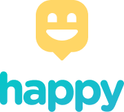
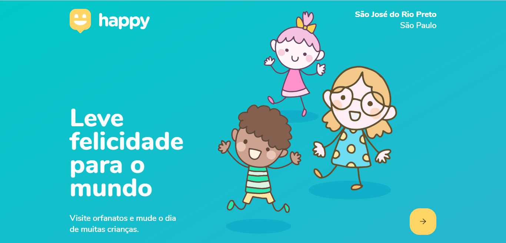
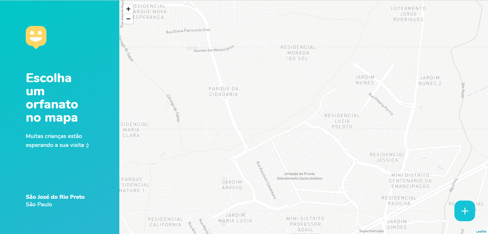
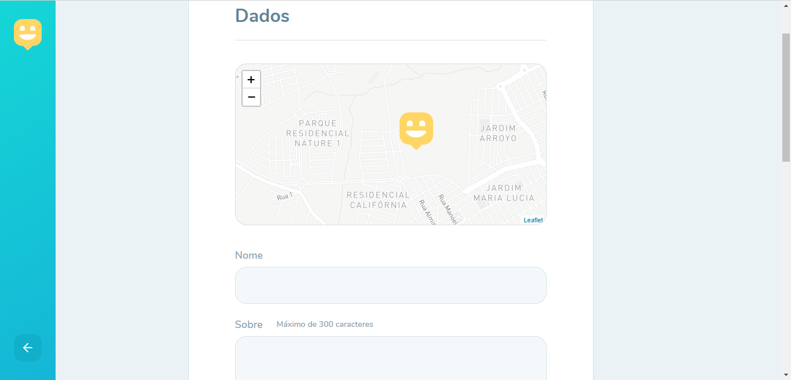
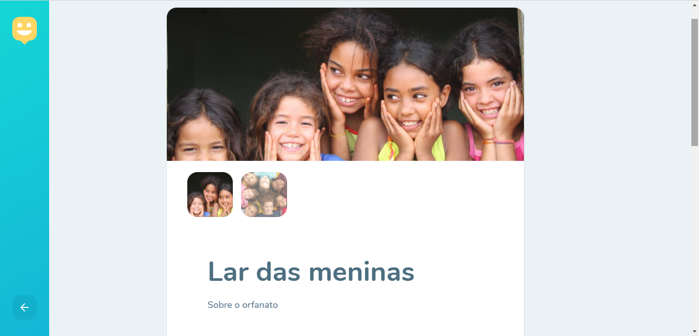

<h2 align="center">  </h2>

  Visite orfanatos e mude o dia de muitas crianças. Um projeto da NLW #3.
  <h2 align="center"> <b> :construction: Em andamento :construction: </b> </h2>
  
 Feito com :yellow_heart: por Gabriel Martins :) 

## :email: Sobre
Uma plataforma para localizar os orfanatos mais próximos de você.  
Projeto desenvolvido durante a terceira edição da Next Level Week, dirigida pela :rocket: Rocketseat.

## :computer: Demonstração
<h1 align="center">
  
  
  
  
</h1>

<!-- ## Funcionalidades
- [x] Localização no mapa
- [x] Cadastro de orfanatos -->

## :sparkles: Tecnologias 
- ReactJS
- Typescript
- React Router Dom
- Express
- Leaflet
- Mapbox
- Node.js
- SQLite
### Mobile
- React Native
- Expo
- React Navigation

## :wrench: Ferramentas
- VS Code
- Insomnia
- Beekeeper Studio
- Expo

<!-- ## Instalação -->

## :page_with_curl: Licença
Licenciado pela <a href="./LICENSE.md"> MIT </a>
