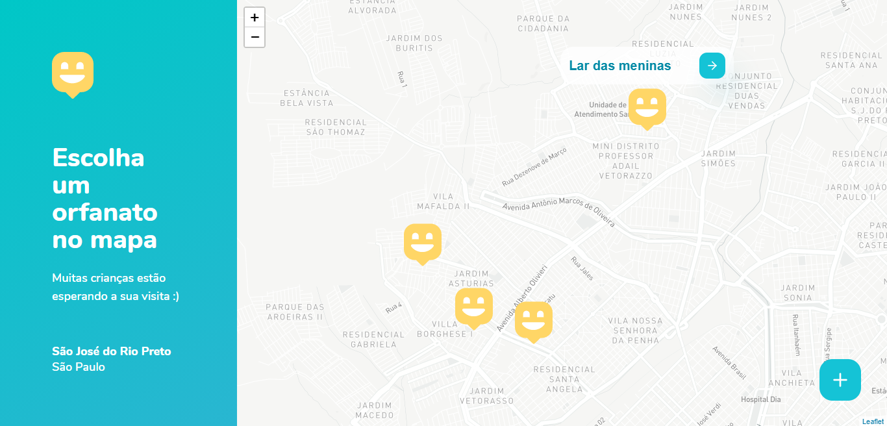

<h1 align="center">Happy</h1>

Visite orfanatos e mude o dia de muitas crianças. Um projeto da NLW 3

## Demonstração
<h1 align="center">
  
  
</h1>

### Funcionalidades
- [x] Localização no mapa
- [] Cadastro de orfanatos

### Tecnologias 
- ReactJS
- Typescript
- React Router Dom
- Leaflet
- Mapbox

### Autor 

 Feito com :yellow_heart: por Gabriel Martins :) 

### Licença
Licenciado pela <a href="./LICENSE.md"> MIT </a>